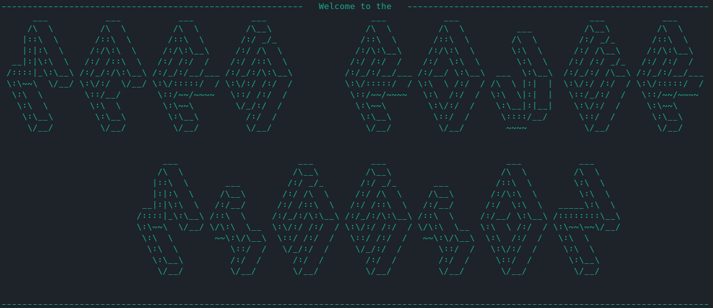

# Mars Rover Missions

Inspired by a kata from the Tech Returners course. It has been extended into an interactive Console App Game. 

## To play

- Clone the repo
- Run `mvn package` to package the project into a `jar` file
- Run `java -jar mars-rover-missions-[VERSION-ID].jar` to play!

### Prerequisites 

- Apache Maven 3.8.4
- Java 17

## Rules / Game Flow

Coming soon...

---
## Design 

Coming soon...

## Future exensions

### Different Plateaus
A user will be able to choose from 3 different plataeus to create (all behaving differently)
1. **Nursery Plateau** (the current implementation) - Moves off the edge of the plataeu are blocked. Moves into other rovers are blocked
2. **Wrapping Plateau** - Moves off the edge of the plateau will wrap. Rovers will jump over other rovers if blocking move
3. **Adult Plateau** - Moves off the edge of the plateau will destory a rover. Moves into other rovers will result in both being blown up.

The code is already well designed with a Plataeu interface to easily implement different plateau options.

### Differnt Rovers
A user will be able to create different types of rovers. In addition to the current implementation, there will be:
1. **Large Rover** - Will move 2 steps in each move command.
2. **Faulty Rover** - Will randomly make incorrect moves and sometime self destruct.

The code is already well designed with a Rover interface to easily implement different rover options.

### Web App
Turn the project into a web app

### Add framworks
- Add Spring
- Add Lombok
